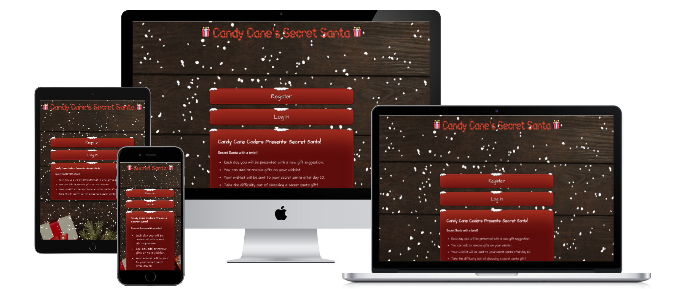
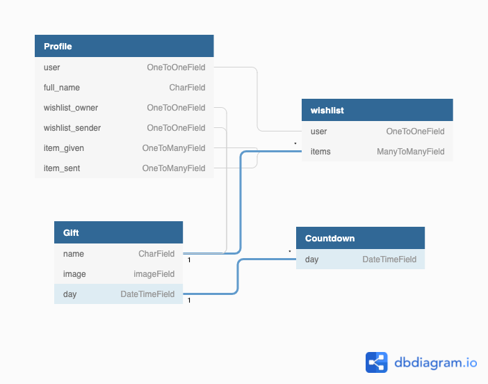

# Candy Cane's  Secret Santa

## [Contents](#contents)

[UX](#ux)

- [User stories](#user-stories)

- [Design](#design)

- [Wireframes](#wireframes)

[Database Model](#database-model)

[Features](#features)

- [Existing Features](#existing-features)

- [Features Left to Implement](#features-left-to-implement)

[Technoloies Used](#technologies-used)

[Deployment](#deployment)

[Testing](#testing)

[Credits](#credits)



## **UX**

### **Overview**

Ho Ho Ho...!!! Still can’t figure out what to get for your co-workers? We’ve got you covered! Candy Cane’s Secret Santa is a virtual secret Santa app from the north pole! Sending and receiving a virtual gift to spice up the holiday season, or get a real gift from the suggestions! The choice is yours! 

[Github Repository](https://github.com/nazarja/candy-cane-coders)

[Live Site](https://candy-canes-secret-santa.herokuapp.com/)

### **User stories**

### **Design**

#### **Color Scheme:**

In the spirit of Christmas, we have decided on a Red White and Green theme, with Red being the dominant color. All text on the site is easy to read with good contrast. 

#### **Fonts**

### **Wireframes:**
To help keep the design scope, wireframes were created for the proposed pages of the site. There was some deviation from the initial design as each page was implemented to improve the user experience but in general it stayed true to the initial design. 

* Mobile Wireframes:
    * [Login Page](wireframes/login-page-responsive.png)
    * [Countdown Page](wireframes/countdown-responsive.png)
    * [Wishlist Page](wireframes/my-wishlist-responsive.png)
    * [Sending / Receiving Page](wireframes/secret-santa-responsive.png)

* Desktop wireframes:
     * [Login Page](wireframes/login-page.png)
    * [Countdown Page](wireframes/countdown.png)
    * [Wishlist Page](wireframes/my-wishlist.png)
    * [Sending / Receiving Page](wireframes/secret-santa.png)

## **Database & Model**

A relational database is best suited to this project given the number of relationships between the models. SQLite was used during development and Heroku Postgres in production. The diagram below may help visualise the database and relationships between each model.



### **Key Models**

#### *Countdown*

- A model for counting down the days left for the draw.

#### *Gift*

- Holds the gift information including it's name, image and which day it belongs to.

#### *Profile*

- contains the user's full name, assign it to the wishlist owner & sender, gifts recieved & sent.

#### *Wishlists*

- This model has relationship with user and gifts.

## **Features**

### **Existing Features**

### **Features Left to Implement**

### **Languages**

- [HTML](https://developer.mozilla.org/en-US/docs/Web/HTML)

- [CSS](https://developer.mozilla.org/en-US/docs/Web/CSS)

- [Python](https://www.python.org/)

- [Javascript](https://developer.mozilla.org/en-US/docs/Web/JavaScript)

### **Frameworks**

- [UIkit](https://getuikit.com/)

- [Django](https://www.djangoproject.com/)

### **Database**

- [sqlite3](https://www.sqlite.org/index.html)

- [Heroku Postgres](https://www.heroku.com/postgres)

### **Extensions and kits**

- [Pillow](https://pillow.readthedocs.io/en/stable/)

### **Project Management**

- [WhiteNoise](http://whitenoise.evans.io/en/stable/index.html#)

- [Github](https://github.com/)

- [Heroku](https://heroku.com)

### **Tools**

- [Website Mockup Generator](https://websitemockupgenerator.com/)

- [Balsamiq](https://balsamiq.com/wireframes/)

- [DB Diagram](https://dbdiagram.io/home)

- [Font Awesome](https://fontawesome.com/)

- [Google Font](https://fonts.google.com/)

## **Deployment**

### **Requirements**

[Python 3](https://www.python.org/downloads/) - core code

[pipenv](https://pypi.org/project/pipenv/) - package installation and python environment control

[Git](https://git-scm.com/) - version control

[WhiteNoise](http://whitenoise.evans.io/en/stable/index.html#) - hosting static files


### **How to Candy Cane's Secret Santa and run locally**

To clone this project from its [GitHub repository](https://github.com/nazarja/candy-cane-coders):

1.From the repository, click **Code**

2.Go to the Clone >> HTTPS section, copy the clone URL for the repository

3.Go to your local IDE open your CLI

4.Change the current working directory to the location where you want the cloned directory to be made

5.Type `git clone`, and then paste the URL you copied in Step 2

```
git clone https://github.com/nazarja/candy-cane-coders
```

6.Press Enter. Your local clone will be created

7.Create a file called env.py to hold your app's environment variables, which should contain the following:

```
import os

os.environ["DEV"] = "1"
os.environ["SECRET_KEY"] = "app secret key of your choice"
os.environ["DATABASE_URL"] = ""
os.environ["HEROKU_URL"] = "*"

```
8.Make sure the following are listed in your .gitignore file to prevent any environment variables being pushed publicly:

```
env.py
__pycache__/
*.sqlite3
*.pyc
Pipfile
Pipfile.lock
.DS_Store
fixtures/
db.json
```
9.Create and activate virtual environment using:
```
pipenv shell
```

10.Install all the app requirements using:

```
pip install -r requirements.txt
```
11.Apply database migrations using:

```
python manage.py migrate
```
12.Create a new superuser and fill in your own details using:

```
python manage.py createsuperuser
```

13.The app can now be running loacally using:

```
python manage.py runserver
```

### **How to deploy to Heroku**

1.Log In to Heroku

2.Select **Create new app** from the dropdown in the Heroku dashboard

3.Choose a unique name('Kumite-dojo') for the app and the location nearest to you

4.Under **Resources** search and add **Heroku Postgres** database to your app and choose the free plan

5.Go to your CLI install **dj_database_url** and **psycopg2** so that you can sue Postges on your deployed site, commands are:
```
pipenv install dj_database_url
pipenv install Psycopg2-binary
```

6.Add those packages to requirements.txt using:
```
pip freeze > requirements.txt
```

7.Go to settings.py, setup the new database using code below:
```
import dj_database_url
```
```
if "DATABASE_URL" in os.environ:
    DATABASES = {"default": dj_database_url.parse(os.environ.get("DATABASE_URL"))}
else:
    DATABASES = {
        "default": {
            "ENGINE": "django.db.backends.sqlite3",
            "NAME": BASE_DIR / "db.sqlite3",
        }
    }
```

9.Set debug using:
```
DEBUG = "DEVELOPMENT" in os.environ
```

10.Get database url from heroku settings > config vars or using:
```
heroku config
```

11.Set `DATABASE_URL` in env.py

12.Log into heroku via Heroku CLI using:
```
heroku login -i
```

13.Migrate the database into Postgres using:
```
python manage.py migrate
```

14.Import all product data using the fixtures created during development

15.Create a new superuser and fill in your own details using:
```
python manage.py createsuperuser
```

16.Install gunicorn
```
pipenv install gunicorn
```

17.Add the package into requirements
```
pip freeze > requirements.txt
```

18.Create a file call **Procfile** and include the following, making sure not to leave a blank line after it:
```
web:gunicorn candy-cane-coders.wsgi:application
```

19.Disable Heroku's static file collection (temporarily)
```
heroku config:set DISABLE_COLLECTSTATIC=1 --app candy-cane-coders
```

20.Add the hostname of your heroku app to settings.py
```
ALLOWED_HOSTS = ["candy-cane-coders.herokuapp.com", "localhost"]
```

21.Commit all changeds to github

22.Go to the **Settings** tab and under **Config Vars** choose **Reveal Config Vars** and set Django secret key where you can find in your env.py as **SECRET_KEY**

23.Initial heroku git remote using:
```
heroku git:remote -a candy-cane-coders
```

24.Deploy to Heroku using:
```
git push heroku main
```

25.Your deployed site can be launched by clicking **Open App** from its page within Heroku.

26.Back in Heroku, select the **Deploy** tab and under **Deployment method** choose GitHub

27.Go to **Connect to GitHub** enter your GitHub repository details and once found, click **Connect**, under **Automatic deploys** choose **Enable Automatic Deploys**

## **Testing**

### **User Stories**

### **Overall user expectations**

#### **Easy navigation**

- Heading descriptive of the content displayed.

- Nabvar clearly indicates page directions.

- Logo directs user back to home page.

- Easy access to features.

#### **Consistency**

- Consistent visual effect throughout the whole site.

- Same navigation system across main pages.

- Images and elements are well contained throughout the site.

#### **Intuitive**

- Familiar icons have been used across the site for commonly expected actions.

- Toasts pop-ups alert the user when they perform actions i.e. login, errors, sucess etc.

#### **Responsiveness**

- Pages adapt a variety of screen sizes and extensive testing in Chrome Dev Tools.

- Page structure has been modified for mobile screen size to ensure readability.

#### **Secure**

- Allauth provides a robust user account system while Stripe offers secure payments, furthered by use of webhooks to ensure transactions are recorded.

#### **Appealing Visuals**

- Red and green Christmas colors throughout the whole site.

- Simple fonts ensure readability and bring content together.

### **As a user I want to ...**

**Immediately understand the purpose of the site and what it can provide**

- The logo and name immediately spell out the purpose and the tone of the site.

- The hero image tells the user, the website is something to do with Chiristmas.

- The header tells the user the purpose of the site.

**Find out how does it work**

- The about section on the home page explains to the user how the site works.

## **Credits**

### **Acknowledgements**